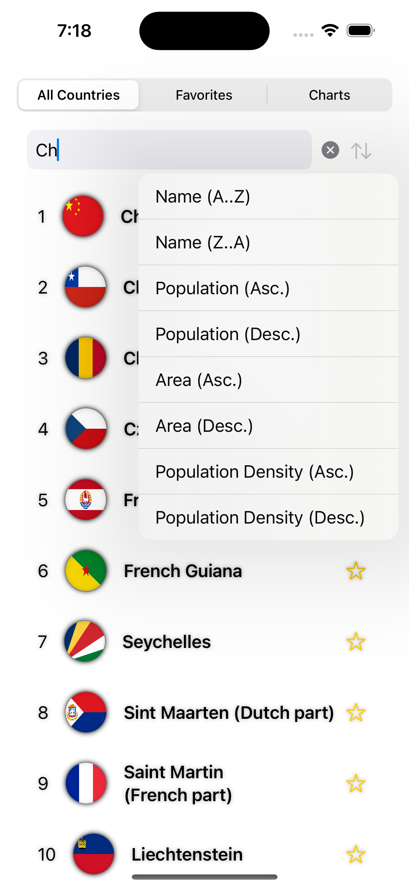
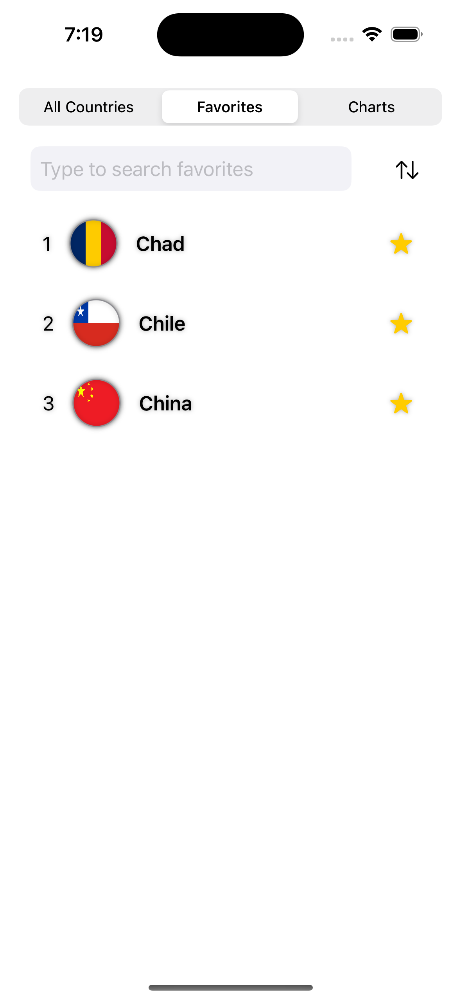
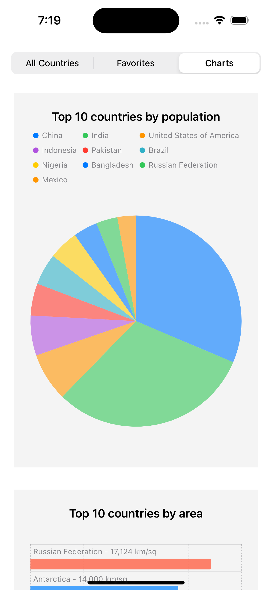

#  World Country List - MAD9137 iOS Programming Assignment

## Description

This application lists all countries along with their flags, which are fetched from an open library. Users can search the country list or sort it using various methods. The app includes a "favorites" feature, allowing users to save their favorite countries locally on the device. Tapping on a country opens detailed information, displaying its rankings compared to other countries. Additionally, the app showcases the top countries based on specific criteria.

## Images

**Main Screen**

**Favorites Screen**

**Charts Screen**

